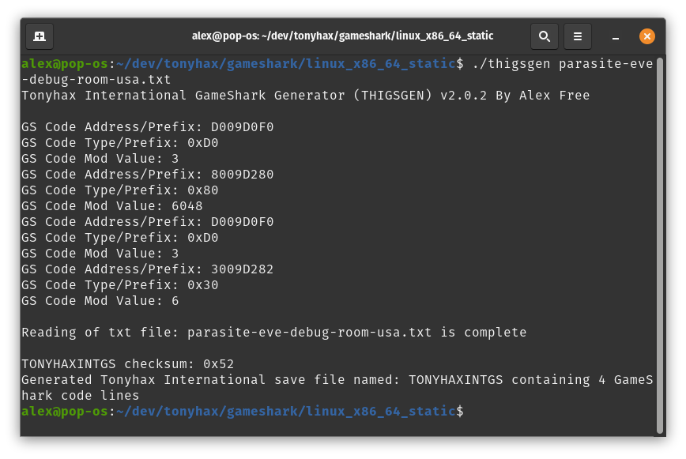

# Tonyhax International GameShark Generator (THIGSGEN)

_By Alex Free_

Tonyhax International now has the ability to apply user-supplied GameShark codes to any game before starting it. This uses my save game GameShark storage system as well as MottZilla's 'Cheat Engine', the latter of which has only previously been put to use by Tonyhax International's built-in [anti-piracy bypass system](anti-piracy-bypass.md). THIGSGEN is the program that generate PS1 memory card save files containing GameShark codes.

| [Homepage](https://alex-free.github.io/tonyhax-international-gameshark-generator) | [GitHub](https://github.com/alex-free/tonyhax-international-gameshark-generator) |

## Table Of Contents

* [Downloads](#downloads)
* [Usage](#usage)
* [Additional Info](#additional-info)
* [Copying The Generated Save File To A PS1 Memory Card](#copying-the-generated-save-file-to-a-ps1-memory-card)
* [Using Generated Save Files With Tonyhax International](#using-generated-save-files-with-tonyhax-international)
* [YouTube Videos](#youtube-videos)
* [License](license.md)
* [Building](build.md)

## Downloads

## Version 2.0.5 (3/8/2025)

Changes:

* Save file names are automatically generated for you! THIGSGEN generates save files in the current folder that you are in, and now names them automatically. If you generate the first save file in your current folder, it will be named `TONYHAXINTGS0`. If you generate subsequent save files while remaining in that same folder, the last number will increase (i.e. `TONYHAXINTGS1`, then `TONYHAXINTGS2`, etc.. up to `TONYHAXINTGS14`). An empty PSX memory card can hold 15 different save files, which is why it stops at `TONYHAXINTGS14` (0-14 is 15). You can put all these files on one empty PSX memory card, and select any of them in the Tonyhax International GameShark save file selection menu.

* Updated the [EzRe](https://github.com/alex-free/ezre) build system to version 1.0.7. A Mac OS build is now available and can be compiled from source. RPM package files are now also available for Linux.

* Improved [test suite](test.md).

* Improved documentation.

* 3-BSD [license](license.md).

----------------------------------------------------

* [thigsgen-v2.0.5-windows-i686-static.zip](https://github.com/alex-free/tonyhax-international-gameshark-generator/releases/download/v2.0.5/thigsgen-v2.0.5-windows-i686-static.zip) _Portable Release For Windows 95 OSR 2.5 and above, Pentium CPU minimum (32 bit)_

* [thigsgen-v2.0.5-windows-x86\_64-static.zip](https://github.com/alex-free/tonyhax-international-gameshark-generator/releases/download/v2.0.5/thigsgen-v2.0.5-windows-x86_64-static.zip) _Portable Release For x86\_64 Windows (64 bit)_

* [thigsgen-v2.0.5-mac-os-x86\_64.zip](https://github.com/alex-free/tonyhax-international-gameshark-generator/releases/download/v2.0.5/thigsgen-v2.0.5-mac-os-x86_64.zip) _Portable Release For Mac OS 10.12 and above, x86\_64 (64 bit)_

* [thigsgen-v2.0.5-linux-i386-static.zip](https://github.com/alex-free/tonyhax-international-gameshark-generator/releases/download/v2.0.5/thigsgen-v2.0.5-linux-i386-static.zip) _Portable Release For Linux 3.2.0 and above, 386 CPU minimum (32 bit)_

* [thigsgen-v2.0.5-linux-i386-static.deb](https://github.com/alex-free/tonyhax-international-gameshark-generator/releases/download/v2.0.5/thigsgen-v2.0.5-linux-i386-static.deb) _Deb package file For Linux 3.2.0 and above, 386 CPU minimum (32 bit)_

* [thigsgen-2.0.5-1.i386.rpm](https://github.com/alex-free/tonyhax-international-gameshark-generator/releases/download/v2.0.5/thigsgen-2.0.5-1.i386.rpm) _RPM package file For Linux 3.2.0 and above, 386 CPU minimum (32 bit)_

* [thigsgen-v2.0.5-linux-x86\_64-static.zip](https://github.com/alex-free/tonyhax-international-gameshark-generator/releases/download/v2.0.5/thigsgen-v2.0.5-linux-x86_64-static.zip) _Portable Release For x86\_64 Linux 3.2.0 and above (64 bit)_

* [thigsgen-v2.0.5-linux-x86\_64-static.deb](https://github.com/alex-free/tonyhax-international-gameshark-generator/releases/download/v2.0.5/thigsgen-v2.0.5-linux-x86_64-static.deb) _Deb package file for x86_64 Linux 3.2.0 and above (64 bit)_

* [thigsgen-2.0.5-1.x86\_64.rpm](https://github.com/alex-free/tonyhax-international-gameshark-generator/releases/download/v2.0.5/thigsgen-2.0.5-1.x86_64.rpm) _RPM package file For Linux 3.2.0 and above, x86_64 CPU minimum (64 bit)_

---------------------------------------

## Usage

`thigsgen <txt file of game shark codes>`

`<txt file of game shark codes>      This should have each GameShark code on it's own line. No blank lines may seperate each code.`

There are 2 ways you can interact with the patcher:

### Drag n' Drop (Windows And Linux)

On Windows and most Linux distributions, you can simply drag the txt file of game shark codes on top of the `thigsgen.exe` (Windows releases) or `thigsgen` (linux releases) executable file found in the portable releases and drop it to start thigsgen with said file as the first argument.

### Traditional CLI (Windows)

1) Open `cmd.exe` (Windows XP+) or `command.com` (Windows 95 - ME). 

2) Drag `thigsgen.exe` into the window. 

2) Type a space in the `command.com` or `cmd.exe` window. 

4) Drag the txt file of game shark codes into the `command.com` or `cmd.exe` window to specify it as an argument, i.e. leaving you with `thigsgen.exe <txt file of game shark codes>`.

5) Press the return/enter key.

### Traditional CLI (Linux/Mac)

1) Start the terminal. 

2) If you have installed the RPM or DEB package file on Linux, you may simply type `thigsgen` into the Terminal window. Otherwise drag `thigsgen` from the extracted release into the terminal window.

3) Type a space in the terminal window.

4) Drag the txt file of game shark codes into the terminal window to specify it as an argument, i.e. leaving you with `thigsgen <txt file of game shark codes>`.

5) Press the return/enter key.

## Additional Info

* THIGSGEN generates save files in the current folder that you are in, and names them automatically. If you generate the first save file in your current folder, it will be named `TONYHAXINTGS0`. If you generate subsequent save files while remaining in that same folder, the last number will increase (i.e. `TONYHAXINTGS1`, then `TONYHAXINTGS2`, etc.. up to `TONYHAXINTGS14`). An empty PSX memory card can hold 15 different save files, which is why it stops at `TONYHAXINTGS14` (0-14 is 15). You can put all these files on one empty PSX memory card, and select any of them in the Tonyhax International GameShark save file selection menu.

* If you put a code line in your txt that has a code prefix that isn't supported, the `TONYHAXINTGS*` file will **not** be generated. You can only have code lines with the above supported code prefixes.

* Each code must be on it's own line, for examples text files please see [here](ttps://github.com/alex-free/tonyhax-international-gameshark-generator/tree/master/examples).

* You can not use the GameShark feature with the [english translation](http://redump.org/disc/37878/) of [Planet Laika](http://redump.org/disc/37878/) due to the translation using the same RAM this uses.

* You can not use the GameShark feature with Spyro Year Of The Dragon releases without tripping the anti-tamper anti-piracy measure.

* All codes beginning with the one of the following prefixes are supported: `30`, `50`, `80`, `D0`, `D1`, `D2`, `D3`, `E0`, `E1`, `E2`, `E3`. More code types will be supported in future releases.

* The amount of codes that may be enabled all at one time simultaneously is hard capped at 255. Up to 139 codes have been verified to work all at once on real PSX hardware.

* Recursive `D0`, `D1`, `D2`, `D3`, `E0`, `E1`, `E2`, and `E3` codes are not yet supported. If the first line is one of the prefixes mentioned previously, the following line must have a prefix of `30`, `50`, or `80`.

## Copying The Generated Save File To A PS1 Memory Card

So now you should have a `TONYHAXINTGS0` file (or multiple files, correctly numbered at the end of the filename with 0 through 14)containing the GameShark codes you desire to use. The next step is to copy the file(s) to your PS1 memory card.

You can use a PS2 console to copy the save files to a PS1 memory card from a USB flash drive.

Requirements:

* A FAT32 formatted USB flash drive that your PS2 console can read. Please note that not all USB flash drives seem to work with PS2 consoles (due to iffy USB 1.1 support found in some newer USB flash drives). You may need to do a bit of trial and error testing to find a USB flash drive that works.

* A soft-modded (or modchipped) PS2 console that can run [WLaunchELF](https://github.com/ps2homebrew/wLaunchELF). You could do this with [FreeHDBoot](https://www.ps2-home.com/forum/viewtopic.php?t=5208) or [FreeMCBoot](https://www.ps2-home.com/forum/viewtopic.php?t=1248).

### Installation With A PS2:

* Copy the `TONYHAXINTGS*` file(s) to the FAT32 USB flash drive using a computer.

* Eject the USB flash drive from your computer and insert it into your PS2 console. Insert a PS1 memory card into your PS2 as well. 

* Start the [WLaunchELF](https://github.com/ps2homebrew/wLaunchELF) homebrew program on your PS2 console. Navigate to the `mass` device (this is your USB flash drive) with the `DPAD` on the controller, then select it with the `circle` button. 

* Using the `DPAD` to navigate, press the `cross` button on the controller to highlight the `TONYHAXINTGS*` file(s) that you previously copied to the USB flash drive. Press the `R1` button on the controller to make the file operations menu appear in [WLaunchELF](https://github.com/ps2homebrew/wLaunchELF). Use the `DPAD` to move to the copy function and then press the `circle` button to select it.

* Press the `triangle` button to navigate out of the `mass` device. Use the `DPAD` and the circle button to navigate into either the `MC0` (if the PS1 memory card is in slot 1 of the PS2) or `MC1` (if the PS1 memory card is in slot 2 of the PS2) device. 

* Press the `R1` button to again make the file operations menu appear in [WLaunchELF](https://github.com/ps2homebrew/wLaunchELF). Use the `DPAD` to navigate to the paste option and press the `circle` button to finally paste the `TONYHAXINTGS0` file. Now you can press the `triangle` button to navigate out of the PS1 memory card device, and remove the memory card from the PS2 console (if you want to use it in a different console).

## Using Generated Save Files With Tonyhax International

1) Insert the memory card in your PSX console. Start Tonyhax International loader.

2) When you see the text `Press CIRCLE to load GameShark codes from a memory card` in the Tonyhax International loader, press the circle button on your controller. You will then see the text `Memory card init...` and the controls for selecting the memory card slot your memory card is inserted into will be displayed.

3) Press triangle to abort loading any codes and to get back to the main menu of the Tonyhax International loader. Press cross to specify the memory card is in slot 1. Press circle to specify slot 2. You will then see the text `Select save file name for memory card in slot 1` (if you picked slot 1) or `Select save file name for memory card in slot 2` (if you picked slot 2).

4) At the bottom of the screen, you will see the current save file name selection (by default it is `bu00:TONYHAXINTGS0` for slot 1 or `bu10:TONYHAXINTGS0` for slot 2). Press the triangle button to increase the file name's number (so each time you press triangle, the selection goes from i.e. for slot 1 you go from `bu00:TONYHAXINTGS0` to `bu00:TONYHAXINTGS1`, to `bu00:TONYHAXINTGS2`, etc. all the way up to `bu00:TONYHAXINTGS14`). To decrease the file name's number press the cross button (so each time you press cross, the selection goes from i.e. for slot 2 from `bu10:TONYHAXINTGS14` to `bu10:TONYHAXINTGS13`, to `bu10:TONYHAXINTGS12`, etc. all the way down to `bu10:TONYHAXINTGS0`).

7) When the selection is correct, press the circle button to confirm it and load that save file. You will then see `X code lines detected` (where `X` is the number of code lines that were found in the save file selected previously). Please note that this can be more then the amount of lines in the txt file used to generate the save file due to how GameShark codes work.

8) Boot your game as normal, and most importantly enjoy the GameShark codes.

## YouTube Videos

Here's some awesome vids by my friend [JMaxxl](https://github.com/JMaxxL):

* [MemoryCard works as gameshark new homebrew update flashed rom PS1](https://www.youtube.com/watch?v=msFBSE9-_n4)
* [New Homebrew Turns MemoryCard into Gameshark 2 Cards PS1](https://www.youtube.com/watch?v=rxkbzgrx2zk)
* [HOW TO gameshark card for Tonyhax International - part 1 slot1](https://www.youtube.com/watch?v=CaTJwnGzPCo)
* [HOW TO 'Tonyhax International' w/gameshark - part 2 slot 2](https://www.youtube.com/watch?v=TNlltRoVvjk)
